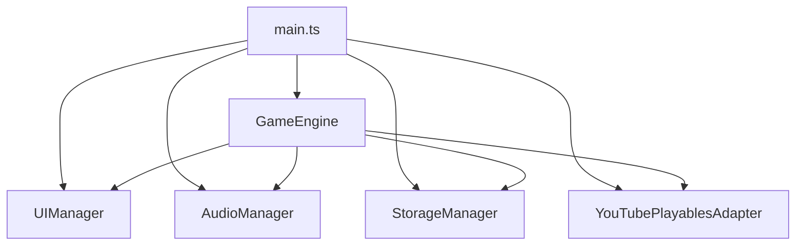

# Neon Rush — YouTube Playables Infinite Runner

A lightweight HTML5 infinite-runner game designed and prepared for YouTube Playables.

---

## 1. PROJECT OVERVIEW

**Neon Rush** is a fast-paced browser-based infinite runner developed as a lightweight HTML5 game. It focuses on instant gameplay, responsive controls, mobile compatibility, procedural graphics, procedural audio, progressive difficulty, and local persistence.

**Gameplay Concept**: The player controls a continuously running character, jumps over obstacles, collects coins, survives increasingly difficult sections, and attempts to achieve the highest possible score.

---

## 2. PROJECT OBJECTIVES

1. Build a complete playable HTML5 game.
2. Support desktop and mobile controls.
3. Create responsive gameplay.
4. Implement progressive difficulty.
5. Implement score and high-score systems.
6. Implement procedural graphics and audio.
7. Avoid unnecessary external assets.
8. Keep the production bundle extremely lightweight.
9. Prepare for YouTube Playables certification.

---

## 3. GAME FEATURES

### Gameplay
* Infinite runner, automatic movement, jumping, double jumping.
* Obstacles (low/high) and coin collection.
* Collision detection with forgiveness scaling.
* Distance and score tracking.
* Achievement system.

### UI
* Loading, Ready, Main Menu, Gameplay HUD, Pause, Game Over screens.
* Responsive to orientation, touch, and pointer.

### Controls
* **Desktop**: Space/Arrow Up (Jump), P (Pause), M (Mute).
* **Mobile**: Tap/Double Tap, large responsive hit targets.

---

## 4. GAME FLOW

1. **BOOT**: Entry point.
2. **Canvas Initialization**: Setup context.
3. **Initial Frame**: Render static background.
4. **`ytgame.firstFrameReady()`**: Signal to YouTube.
5. **Loading UI**: Initialize assets/audio context.
6. **Game Initialization**: Bind handlers.
7. **`ytgame.gameReady()`**: Signal to YouTube.
8. **Main Menu**: Await user input.
9. **Gameplay**: Loop.
10. **Pause/Resume**: Visibility/System hooks.
11. **Game Over**: Score submission.

---

## 5. TECHNOLOGY STACK

* **TypeScript**: Core language.
* **Vite**: Build tool and bundler.
* **HTML5 Canvas 2D**: Rendering engine.
* **Web Audio API**: Procedural sound and music engine.
* **LocalStorage**: High score/settings persistence.
* **Node.js Test Runner**: Via `tsx` for unit tests.

---

## 6. PROJECT ARCHITECTURE



---

## 7. YOUTUBE PLAYABLES INTEGRATION

`src/youtube/YouTubePlayablesAdapter.ts` isolates interactions.

### SDK Discovery & API
The project uses the Google-hosted ESM module integration:
```typescript
import ytgame from 'https://www.gstatic.com/ytgame/sdk/ytgame.mjs';
const sdk = await ytgame.game.initializeSdk();
```

### Score Submission
```typescript
sdk.sendScore({ value: BigInt(score) });
```

---

## 8. DEVELOPMENT FALLBACK
`window.__ytdev` provides local helpers: `pause()`, `resume()`, `audioOff()`, `audioOn()`.

---

## 9. PERFORMANCE
- **Production bundle**: ~29.27 KB uncompressed / ~9.51 KB gzipped.
- Zero runtime dependencies, no external images or audio files.

---

## 10. REPOSITORY STRUCTURE

```text
neon-rush-youtube-playable/
├── src/
│   ├── audio/
│   ├── game/
│   ├── storage/
│   ├── ui/
│   ├── youtube/
│   └── main.ts
├── tests/
├── docs/
├── package.json
├── tsconfig.json
├── vite.config.ts
├── README.md
├── REDEME.md
├── CHANGELOG.md
└── LICENSE
```

---

## 11. CERTIFICATION STATUS
> Development complete. Playables-ready. Official YouTube certification pending.

---

## 12. FINAL PROJECT SUMMARY
Neon Rush v1.0.0 is a lightweight HTML5 infinite-runner game built with TypeScript, Vite, Canvas2D, and Web Audio API. It features 46 passing tests and a highly optimized build.
